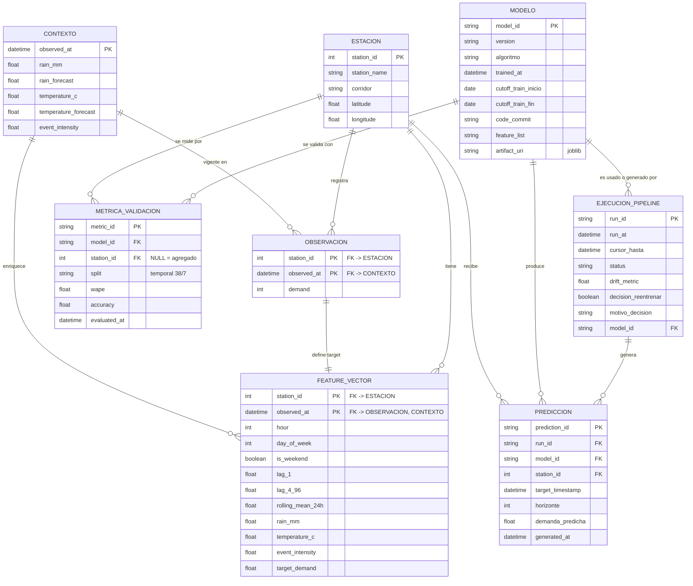

# Modelo de datos

Diagrama entidad-relación del proyecto. Cubre los tres datasets que entrega el
API del starter kit (estaciones, observaciones, contexto) y la capa adicional
que necesita el pipeline de Machine Learning: vectores de features, registro
de modelos, métricas de validación, predicciones y ejecuciones del pipeline
(para la trazabilidad de reentrenamiento que pide el proyecto).

Versión navegable con más contexto: [artifact publicado](https://claude.ai/artifact/JBD3RqtZXn7vyoe9w43d98).

## Datos fuente — vienen tal cual del API

- **ESTACION** — catálogo fijo de las 12 estaciones (`station_id` es la clave
  natural, no cambia durante el reto).
- **OBSERVACION** — demanda cada 15 min por estación. Clave compuesta
  `(station_id, observed_at)`; es la tabla que crece con cada actualización.
- **CONTEXTO** — clima y eventos a nivel de todo el sistema, no por estación:
  una fila de contexto aplica a las 12 estaciones en ese mismo `observed_at`.

## Capa de Machine Learning — construida sobre lo anterior

- **FEATURE_VECTOR** *(Preparador)* — une observación + contexto y agrega
  variables derivadas (hora, día, lags, rolling mean). `target_demand` es lo
  que predice el modelo.
- **MODELO** *(Empaquetador)* — un registro por versión entrenada: qué datos
  vio (`cutoff`), qué commit de código, dónde está el `.joblib`. Es el
  contrato de trazabilidad que pide el README del starter kit.
- **METRICA_VALIDACION** *(Entrenador)* — WAPE / Accuracy por modelo, a nivel
  agregado y por estación, con validación temporal (38 días train / 7 test),
  nunca split aleatorio.
- **EJECUCION_PIPELINE** *(Monitor)* — una fila por corrida del pipeline
  (GitHub Actions): hasta dónde procesó, drift medido, y si decidió
  reentrenar y por qué.
- **PREDICCION** *(Aplicación)* — salida final: demanda pronosticada por
  estación, a 4 horizontes, con la versión del modelo que la generó — lo que
  se envía como submission.

Flujo: `ESTACION + OBSERVACION + CONTEXTO → FEATURE_VECTOR → MODELO → METRICA_VALIDACION → EJECUCION_PIPELINE → PREDICCION`

> Nota: este es el esquema de trabajo del equipo, no la especificación oficial
> de submissions/leaderboard (el README del starter kit aclara que ese
> contrato "se publicará antes de iniciar la ventana competitiva").
